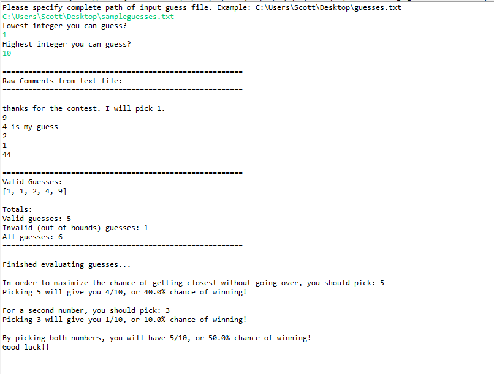

# FBGuessANumberContest
Program helps user win a contest of type: pick closest number between x and y without going over 
When other guesses are known (such as on online comments on Youtube or Facebook)

By providing a text file containing guesses already made by other contestants, program will find the largest remaining gap.

